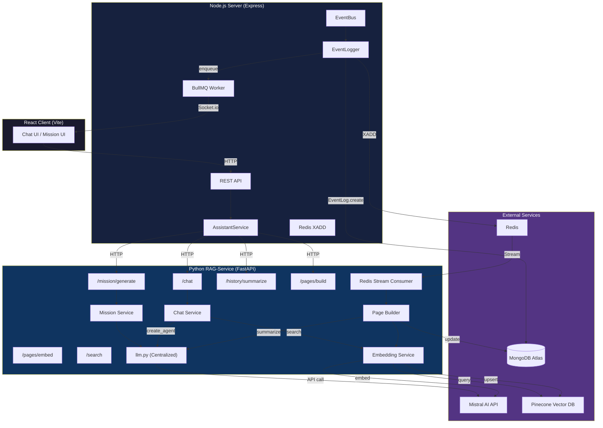
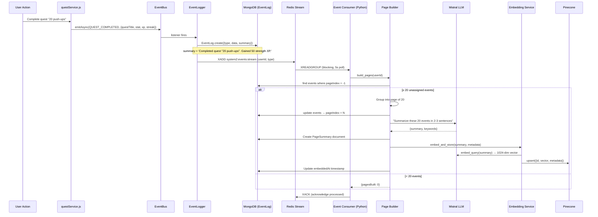
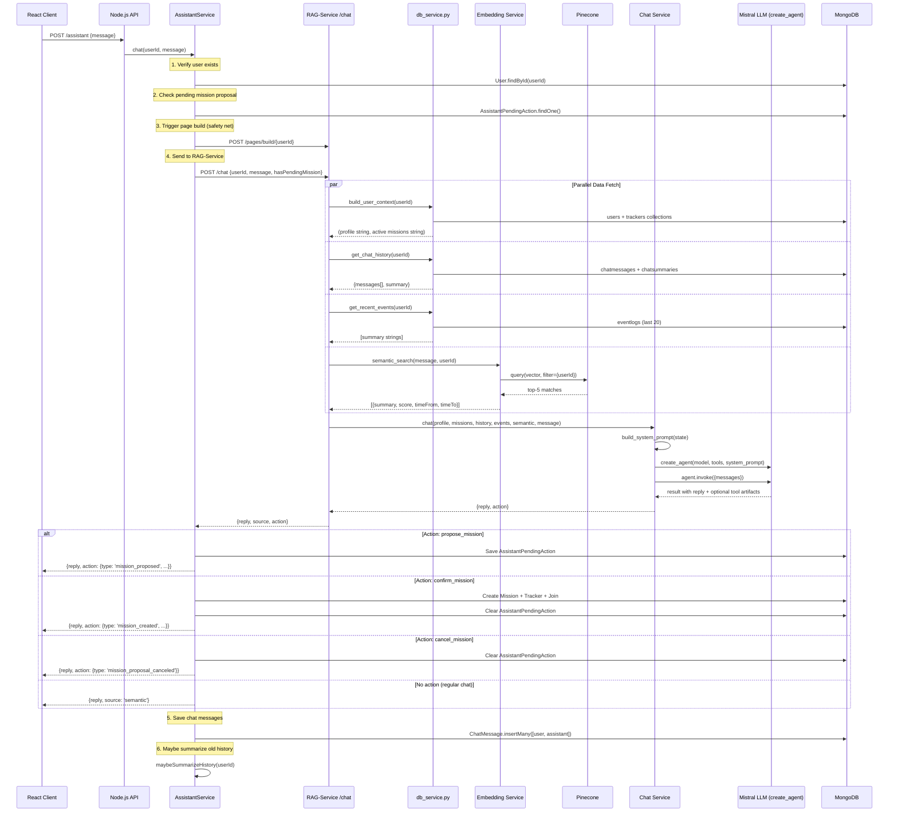
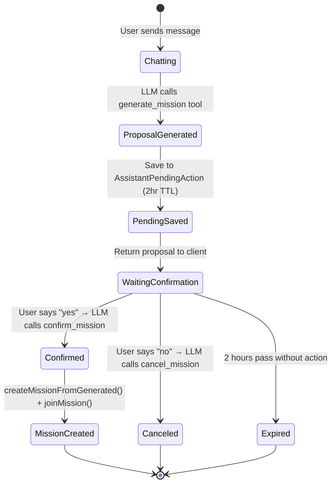
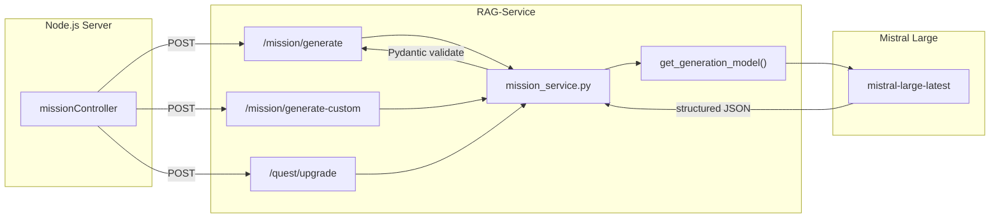
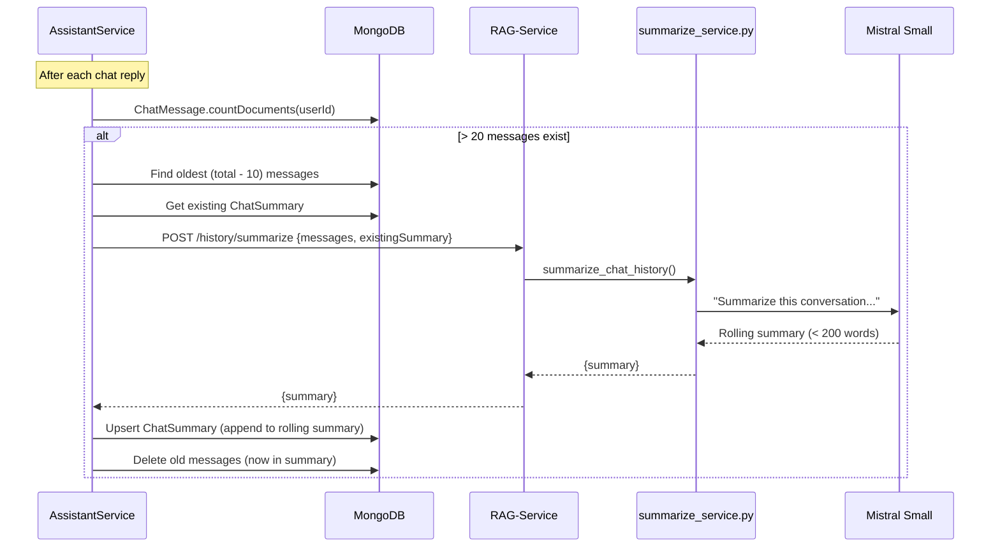
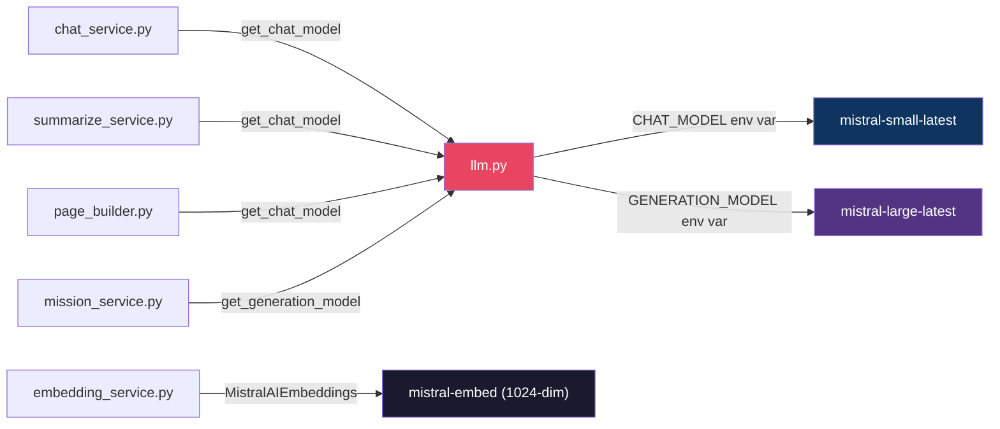
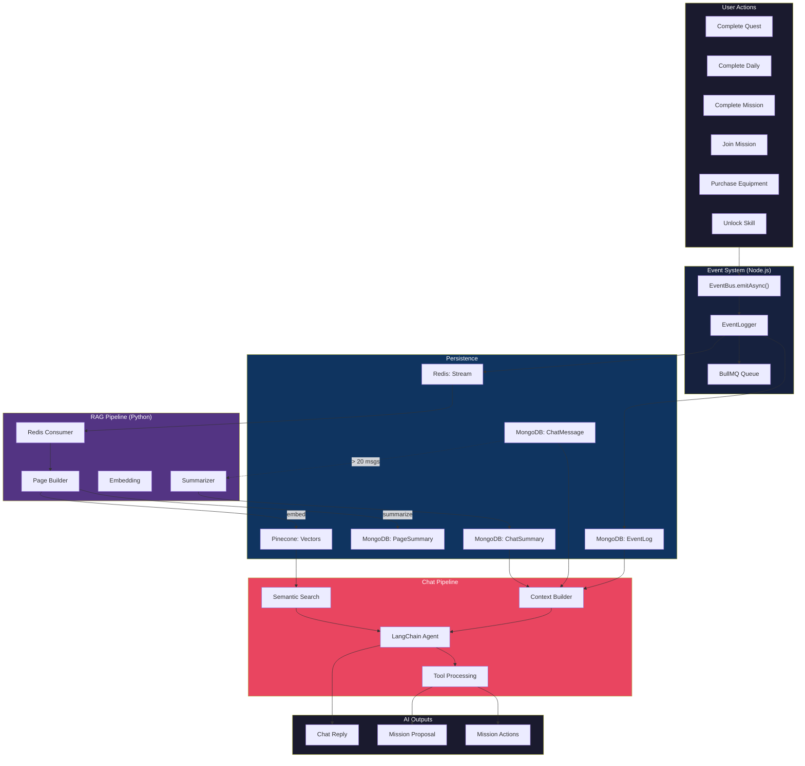
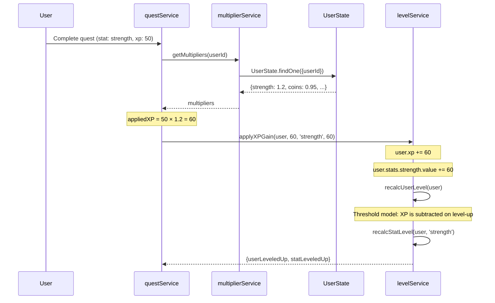

# System 2.0 — AI Services Architecture

> A gamified self-improvement platform inspired by Solo Leveling.  
> This document covers every AI pipeline: how data flows, how memory is built, and how the assistant reasons.

---

## High-Level System Overview



---

## Service Boundaries

| Service | Language | Framework | Role |
|---------|----------|-----------|------|
| **Node.js Server** | JavaScript | Express + Mongoose | REST API, auth, game logic, event emission, chat orchestration |
| **RAG-Service** | Python | FastAPI + LangChain | All AI work: LLM calls, embeddings, vector search, page building |
| **MongoDB** | — | Atlas | Users, trackers, quests, events, chat history, page summaries |
| **Pinecone** | — | Serverless | 1024-dim semantic vectors for long-term user memory |
| **Redis** | — | Streams + BullMQ | Cross-service event delivery + notification queue |
| **Mistral AI** | — | API | LLM (chat, generation, summarization) + embeddings |

### Why Two Services?

The Node.js server owns **game state** (users, quests, trackers, auth). The Python RAG-Service owns **all AI work** (LLM calls, embeddings, vector search). This separation means:
- AI code uses Python's ML ecosystem (LangChain, Pinecone SDK, Pydantic)
- Game logic stays in the battle-tested Express/Mongoose stack
- Each service scales independently
- `MISTRAL_API_KEY` only needs to be in the RAG-Service `.env`

---

## Pipeline 1: RAG Memory Construction

This is how user actions become searchable AI memory.



### Event Types Captured

| Event | Trigger | Summary Example |
|-------|---------|-----------------|
| `quest:completed` | User checks off a quest | `Completed quest "20 push-ups". Gained 50 strength XP. Streak: 3.` |
| `daily:completed` | All quests done for the day | `Finished all daily quests for "30-Day Fitness"! Streak: 3, Day 5.` |
| `mission:completed` | Mission duration reached | `Completed mission "30-Day Fitness". Full duration achieved!` |
| `mission:joined` | User joins a mission | `Joined mission "Marathon Prep".` |
| `equipment:purchased` | User buys gear | `Purchased "Shadow Gauntlets" for 50 coins. Gained: strength +2 levels.` |
| `skill:unlocked` | User unlocks a skill | `Unlocked skill "Critical Focus".` |
| `rank:ascended` | User rank-up | `Ascended to rank B! Reward: 200 XP, 50 coins.` |
| `penalty:applied` | Missed daily / mission fail | `Penalty applied on "30-Day Fitness" (skip). Lost 2 stat XP.` |
| `sidequest:completed` | Ad-hoc quest done | `Completed sidequest "Read 20 pages" (medium). Stat: intelligence.` |
| `sidequest:created` | User creates custom quest | `Created sidequest "Read 20 pages" (medium, intelligence).` |
| `title:unlocked` | Achievement earned | `Earned title "Shadow Monarch".` |

### Page Building Details

- **Page size:** 20 events per page
- **Summarization model:** `mistral-small-latest` (via `get_chat_model()`)
- **Embedding model:** `mistral-embed` (1024 dimensions)
- **Vector store:** Pinecone serverless (AWS us-east-1, cosine similarity)
- **Vector ID format:** `{userId}__page_{pageIndex}`
- **Metadata stored:** userId, pageIndex, timeFrom, timeTo, eventCount, keywords

### Delivery Guarantee

Redis Streams with consumer groups provide **at-least-once delivery**:
- Messages persist until explicitly acknowledged (`XACK`)
- If the RAG-Service is offline, events queue up in the stream
- On restart, unacknowledged messages are re-delivered
- HTTP fallback: Node.js also calls `POST /pages/build/{userId}` as a safety net

---

## Pipeline 2: AI Chat (Growth Assistant)

The chat flow from user message to AI response.



### Memory Layers

The AI assistant has access to **4 layers of memory**, each serving a different time horizon:

```
┌─────────────────────────────────────────────────┐
│  Layer 1: Real-Time Player State (db_service)   │
│  ─ Stats, level, rank, coins, equipment, skills │
│  ─ Active missions with progress and streaks    │
│  ─ Always fresh — fetched from MongoDB per call │
├─────────────────────────────────────────────────┤
│  Layer 2: Recent Events (last 20 EventLogs)     │
│  ─ Raw event summaries from the past few days   │
│  ─ "Completed quest '20 push-ups' (50 STR XP)" │
│  ─ Short-term memory: what happened recently    │
├─────────────────────────────────────────────────┤
│  Layer 3: Chat History (last 10 messages)       │
│  ─ Recent conversation context                  │
│  ─ Enables multi-turn dialogue continuity       │
│  ─ Rolling summary for conversations > 20 msgs  │
├─────────────────────────────────────────────────┤
│  Layer 4: Semantic Memory (Pinecone vectors)    │
│  ─ LLM-summarized pages of 20 events each      │
│  ─ Searched by cosine similarity to user query  │
│  ─ Long-term memory: weeks/months of history    │
│  ─ "2 weeks ago you focused on endurance..."    │
└─────────────────────────────────────────────────┘
```

### Chat Agent Tools

The assistant uses LangChain's `create_agent()` with three tools that let it perform actions, not just reply:

| Tool | Purpose | Returns |
|------|---------|---------|
| `generate_mission(description, days)` | Calls `mission_service.generate_mission_from_description()` to create a structured mission | Artifact with `{intent: "propose_mission", mission, days}` |
| `confirm_mission()` | Signals user confirmed the pending proposal | Artifact with `{intent: "confirm_mission"}` |
| `cancel_mission()` | Signals user rejected the pending proposal | Artifact with `{intent: "cancel_mission"}` |

Tools use LangChain's `content_and_artifact` response format — the text response goes to the LLM, the structured artifact is extracted by `_compose_reply()` and returned as the `action` field.

### Mission Proposal Flow



---

## Pipeline 3: Mission Generation



### Three Generation Modes

| Endpoint | Input | Output | Model |
|----------|-------|--------|-------|
| `POST /mission/generate` | `{description, days}` | Full mission with quests, rewards, penalties | `mistral-large-latest` |
| `POST /mission/generate-custom` | `{quests[], days}` | Mission built around user's custom quest titles | `mistral-large-latest` |
| `POST /quest/upgrade` | `{quests[]}` | Harder versions of existing quests | `mistral-large-latest` |

All three follow the same pattern:
1. Build a structured prompt with JSON schema
2. Call `get_generation_model().invoke()` (LangChain)
3. Extract JSON from response (handles ```json blocks)
4. Validate with Pydantic (`MissionGenerationResponse`)
5. Return clean, typed response

### Generated Mission Schema

```json
{
  "title": "30-Day Strength Builder",
  "refinedDescription": "Build upper body and core strength...",
  "quests": [
    {"title": "30 push-ups", "statAffected": "strength", "xp": 35},
    {"title": "1-minute plank", "statAffected": "endurance", "xp": 25}
  ],
  "reward": {"xp": 150, "coins": 30, "specialReward": null},
  "penalty": {
    "missionFail": {"coins": 15, "stats": 3},
    "skip": {"coins": 8, "stats": 1}
  },
  "rank": "C"
}
```

---

## Pipeline 4: Chat History Summarization



### Why Rolling Summaries?

- **Problem:** Chat messages have a 30-day TTL in MongoDB. Without summaries, the assistant loses all context after a month.
- **Solution:** When messages exceed 20, the oldest batch gets summarized into a rolling paragraph. The summary persists indefinitely.
- **Result:** The assistant always has: last 10 raw messages (short-term) + rolling summary (long-term) + semantic search (weeks/months).

---

## Centralized Model Configuration

All AI service files import their LLM from a single file:

```python
# services/llm.py

get_chat_model()        → mistral-small-latest  (chat, summarization, page building)
get_generation_model()  → mistral-large-latest  (mission generation, quest upgrade)
```

### Model Usage Map



### Switching Providers

To switch from Mistral to another provider (e.g., OpenAI):
1. Edit `services/llm.py` — change `ChatMistralAI` to `ChatOpenAI`
2. Set env vars: `CHAT_MODEL=gpt-4.1-mini`, `GENERATION_MODEL=gpt-4.1`
3. Install the provider package: `pip install langchain-openai`
4. **Embeddings stay Mistral** — switching embedding providers requires re-indexing all Pinecone vectors (different dimensions)

---

## Data Flow Summary



---

## File Map

### RAG-Service (Python)

| File | Lines | Purpose |
|------|-------|---------|
| `server.py` | 293 | FastAPI app, 8 endpoints, CORS, lifespan, auth |
| `services/llm.py` | 55 | Centralized LLM config (`get_chat_model`, `get_generation_model`) |
| `services/chat_service.py` | 168 | LangChain agent with 3 tools, system prompt builder |
| `services/mission_service.py` | 190 | Structured mission generation (3 modes) |
| `services/embedding_service.py` | 221 | Mistral embeddings + Pinecone CRUD + semantic search |
| `services/page_builder.py` | 219 | 20-event page grouping + LLM summarization + embedding |
| `services/summarize_service.py` | 56 | Rolling chat history summarization |
| `services/db_service.py` | 98 | Async MongoDB context building (Motor) |
| `workers/event_consumer.py` | 140 | Redis Streams consumer (daemon thread) |
| `models/schemas.py` | — | Pydantic request/response schemas |

### Node.js Server (relevant AI files)

| File | Purpose |
|------|---------|
| `events/eventBus.js` | Async event bus (11 event types) |
| `events/eventLogger.js` | Wires events → MongoDB + Redis + BullMQ |
| `services/assistantService.js` | Chat orchestrator — context assembly, action handling, history management |
| `services/ragService.js` | HTTP client for RAG-Service endpoints |
| `Models/eventLog.js` | EventLog + PageSummary Mongoose schemas |
| `Models/chatHistory.js` | ChatMessage + ChatSummary Mongoose schemas |

---

## Key Design Decisions

### Why LangChain `create_agent()` instead of raw API calls?
The chat assistant needs **tool calling** — the LLM must decide when to call `generate_mission` vs just replying. `create_agent()` handles the tool-call loop (LLM → tool → LLM → response) automatically. Raw API calls would require manually implementing this loop.

### Why Redis Streams instead of Pub/Sub?
Pub/Sub is fire-and-forget — if the RAG-Service is offline, events are lost. Redis Streams with consumer groups provide at-least-once delivery, message persistence, and position tracking. Events queue up during downtime and are consumed on restart.

### Why pages of 20 events instead of embedding each event individually?
Individual events ("completed quest X") are too granular for semantic search — they don't capture patterns. Grouping 20 events into a page and summarizing with an LLM produces richer, more searchable text like "the user focused on strength training this week, completing 15 push-up quests with a 12-day streak."

### Why rolling summaries instead of keeping all chat messages?
Messages have a 30-day TTL (storage cost). Rolling summaries compress weeks of conversation into a ~200-word paragraph that persists forever. The assistant gets: recent messages (verbatim) + summary (compressed history) + semantic search (event-based).

### Why separate models for chat vs generation?
Chat uses `mistral-small-latest` (fast, cheap, good enough for conversation). Mission generation uses `mistral-large-latest` (better at following complex JSON schemas and producing creative, balanced quest designs).

---

## Environment Variables

### RAG-Service `.env`

| Variable | Purpose | Example |
|----------|---------|---------|
| `MISTRAL_API_KEY` | All Mistral API calls (chat, generation, embeddings) | `sk-...` |
| `PINECONE_API_KEY` | Vector storage and retrieval | `pc-...` |
| `PINECONE_INDEX` | Index name | `system2-rag` |
| `MONGO_URI` | Direct MongoDB access for context building | `mongodb+srv://...` |
| `REDIS_URL` | Stream consumer connection | `redis://localhost:6379` |
| `RAG_SERVICE_SECRET` | Shared secret for inter-service auth | `my-secret` |
| `CHAT_MODEL` | Override chat model (default: `mistral-small-latest`) | `gpt-4.1-mini` |
| `GENERATION_MODEL` | Override generation model (default: `mistral-large-latest`) | `gpt-4.1` |
| `RAG_ALLOWED_ORIGINS` | CORS origins | `http://localhost:3000` |

### Node.js Server `.env` (AI-relevant)

| Variable | Purpose |
|----------|---------|
| `RAG_SERVICE_URL` | RAG-Service base URL (`http://localhost:8000`) |
| `RAG_SERVICE_SECRET` | Shared secret (must match RAG-Service) |
| `REDIS_URL` | For XADD event publishing |

---

## Inter-Service Communication

The Node.js server communicates with the Python RAG-Service through `ragService.js` — a thin HTTP client with graceful degradation.

```mermaid
graph LR
    subgraph Node["Node.js Server"]
        AS["assistantService.js"]
        MS["missionService.js"]
        RS["ragService.js<br/>(HTTP client)"]
    end

    subgraph RAG["Python RAG-Service"]
        C["/chat"]
        M1["/mission/generate"]
        M2["/mission/generate-custom"]
        Q["/quest/upgrade"]
        S["/history/summarize"]
        P["/pages/build/:id"]
        H["/health"]
    end

    AS --> RS
    MS --> RS
    RS -->|POST + 60s timeout| C
    RS -->|POST| M1
    RS -->|POST| M2
    RS -->|POST| Q
    RS -->|POST| S
    RS -->|POST| P
    RS -->|GET (cached 60s)| H
```

### Client Features

| Feature | Implementation |
|---------|---------------|
| **Timeout** | `AbortSignal.timeout(60_000)` on every request |
| **Auth** | `X-Rag-Secret` header (shared secret from env) |
| **Health cache** | `isRAGServiceAvailable()` caches result for 60s |
| **Graceful degradation** | Every function returns a safe default on failure (empty array, null, existing summary) |
| **Fire-and-forget** | `triggerPageBuild()` is non-blocking with `.catch()` |

### When RAG-Service is down

If the RAG-Service is unreachable, the assistant returns a **degraded response**:
```
"I'm having trouble accessing my full memory right now, but I remember 
you're [username]. Try again in a moment for a more detailed analysis!"
```
No crash, no 500. The user can still interact with the rest of the app.

---

## Pipeline 5: XP Gain & Multiplier System

When a quest is completed, XP isn't applied raw — it goes through a multiplier pipeline:



### Multiplier Sources

| Source | Type | Example |
|--------|------|---------|
| **Equipment** | Additive per-stat | Shadow Gauntlets: `strength +0.1` |
| **Equipment** | Additive all-stats | Ring of Power: `all +0.05` |
| **Equipment** | Additive coins | Merchant's Amulet: `coins +0.15` |
| **Skills** | Multiplicative XP | Focus I: `xp_multiplier: 1.1` |
| **Skills** | Additive stat bonus | Strength Mastery: `stat_bonus: {strength: 0.2}` |
| **Penalty** | Temporary coin penalty | Streak break: `coins × 0.95` (-5%) |

### Penalty ↔ Multiplier Interaction

```
Streak break (skip penalty) → applyTemporaryCoinPenalty()
    → coinPenaltyActive = true
    → coins multiplier × 0.95

Next daily completion → clearTemporaryCoinPenalty()
    → coinPenaltyActive = false
    → coins multiplier ÷ 0.95 (restored)
```

---

## RAG-Service API Reference

| Method | Endpoint | Input | Output | Consumer |
|--------|----------|-------|--------|----------|
| POST | `/chat` | `{userId, message, hasPendingMission}` | `{reply, source, action?}` | `assistantService.js` |
| POST | `/mission/generate` | `{description, days}` | `MissionGenerationResponse` | `missionService.js` |
| POST | `/mission/generate-custom` | `{quests[], days}` | `MissionGenerationResponse` | `missionService.js` |
| POST | `/quest/upgrade` | `{quests[]}` | `{quests: MissionQuest[]}` | `adaptiveQuest.js` |
| POST | `/history/summarize` | `{messages[], existingSummary}` | `{summary}` | `assistantService.js` |
| POST | `/pages/embed` | `{userId, pageIndex, summary, ...}` | `{success, pineconeId}` | Internal (page builder) |
| POST | `/search` | `{userId, query, topK}` | `{results[]}` | Internal (chat endpoint) |
| POST | `/pages/build/:userId` | — | `{pagesBuilt, errors}` | `assistantService.js` (safety net) |
| DELETE | `/users/:userId` | — | `{deleted, userId}` | GDPR compliance |
| GET | `/health` | — | `{status, pinecone, mistral}` | `ragService.js` health check |

---

## Cross-Cutting Architecture Notes

### Two MongoDB Drivers in RAG-Service
The RAG-Service has **two separate MongoDB connections**:
- `db_service.py` uses **Motor** (async) — called by FastAPI endpoints via `asyncio.gather`
- `page_builder.py` uses **PyMongo** (sync) — runs in a background daemon thread

This is intentional: the page builder runs in a blocking thread (not an async coroutine), so it needs a sync driver. Both parse the same `MONGO_URI`.

### Idempotent Vector IDs
Pinecone vector IDs follow the format `{userId}__page_{pageIndex}`. Since page indices are monotonically increasing and deterministic, re-running the page builder for the same events produces the same vector IDs — making upserts idempotent (no duplicates).

### Event Fan-Out Pattern
Every user action fans out to **3 destinations** from a single `eventBus.emitAsync()` call:

```
EventBus.emitAsync()
    ├── MongoDB EventLog.create()     → Persistent storage (RAG source data)
    ├── Redis XADD                    → Python consumer (page building)
    └── BullMQ enqueue                → Node.js worker (Socket.io push notification)
```

### Two Paths to Mission Creation
Missions can be created via:
1. **Direct REST**: `POST /missions/generate` → Node.js controller → RAG-Service → save to MongoDB
2. **Chat tool**: User asks assistant → LLM calls `generate_mission` tool → artifact returned → user confirms → `confirm_mission` tool → `createMissionFromGenerated()` + auto-join

Both paths end up calling the same `mission_service.generate_mission_from_description()` in Python.

### Graceful Degradation Layers

```
Full mode:    Semantic search + recent events + chat history + summary + live profile
    ↓ (Pinecone down)
Reduced:      Recent events + chat history + summary + live profile
    ↓ (RAG-Service down)  
Degraded:     "I'm having trouble accessing my full memory..." + username only
    ↓ (MongoDB down)
Error:        "I couldn't find your player profile."
```

