# System 2.0 — Complete System Architecture

> A gamified self-improvement platform inspired by Solo Leveling.
> This document covers every system: game mechanics, data models, API design, event pipelines, frontend architecture, and design decisions.

---

## High-Level System Overview

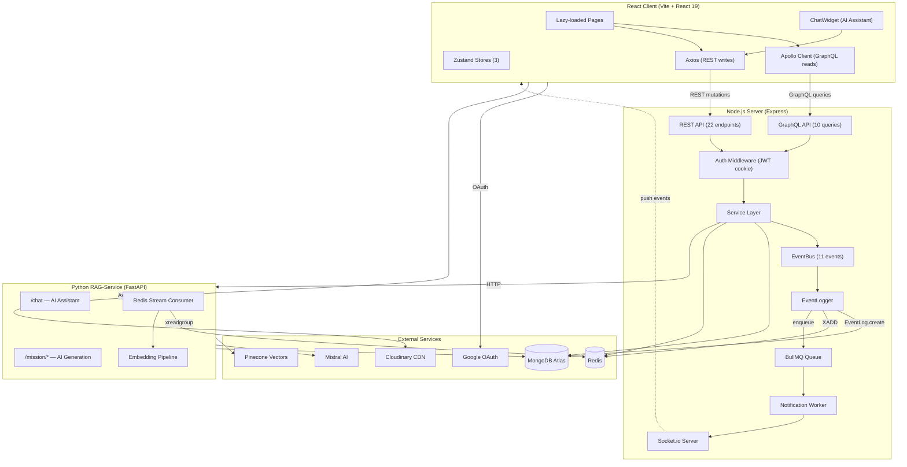
```mermaid
graph TB
    subgraph Client["React Client (Vite + React 19)"]
        Pages["Lazy-loaded Pages"]
        Stores["Zustand Stores (3)"]
        Apollo["Apollo Client (GraphQL reads)"]
        Axios["Axios (REST writes)"]
        Chat["ChatWidget (AI Assistant)"]
    end

    subgraph Server["Node.js Server (Express)"]
        REST["REST API (22 endpoints)"]
        GQL["GraphQL API (10 queries)"]
        MW["Auth Middleware (JWT cookie)"]
        SVC["Service Layer"]
        EB["EventBus (11 events)"]
        EL["EventLogger"]
        BQ["BullMQ Queue"]
        WK["Notification Worker"]
        SK["Socket.io Server"]
    end

    subgraph RAG["Python RAG-Service (FastAPI)"]
        ChatEP["/chat — AI Assistant"]
        MissionEP["/mission/* — AI Generation"]
        EmbedEP["Embedding Pipeline"]
        Consumer["Redis Stream Consumer"]
    end

    subgraph External["External Services"]
        MongoDB[(MongoDB Atlas)]
        Redis[(Redis)]
        Mistral["Mistral AI"]
        Pinecone["Pinecone Vectors"]
        Google["Google OAuth"]
        Cloudinary["Cloudinary CDN"]
    end

    Pages --> Apollo
    Pages --> Axios
    Chat --> Axios
    Apollo -->|GraphQL queries| GQL
    Axios -->|REST mutations| REST
    REST --> MW --> SVC
    GQL --> MW
    SVC --> EB
    EB --> EL
    EL -->|EventLog.create| MongoDB
    EL -->|XADD| Redis
    EL -->|enqueue| BQ
    BQ --> WK
    WK --> SK
    SK -.->|push events| Client
    Consumer -->|xreadgroup| Redis
    Consumer --> EmbedEP
    SVC -->|HTTP| RAG
    RAG --> Mistral
    RAG --> Pinecone
    RAG --> MongoDB
    SVC --> MongoDB
    SVC --> Redis
    Client -->|OAuth| Google
    Client -->|Avatar upload| Cloudinary
```

---

## Data Fetching Strategy: Dual Protocol

System 2.0 uses **GraphQL for reads** and **REST for writes/actions**. This is intentional — not accidental.

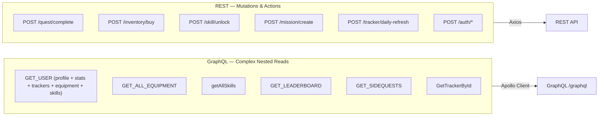
```mermaid
graph LR
    subgraph Reads["GraphQL — Complex Nested Reads"]
        R1["GET_USER (profile + stats + trackers + equipment + skills)"]
        R2["GET_ALL_EQUIPMENT"]
        R3["getAllSkills"]
        R4["GET_LEADERBOARD"]
        R5["GET_SIDEQUESTS"]
        R6["GetTrackerById"]
    end

    subgraph Writes["REST — Mutations & Actions"]
        W1["POST /quest/complete"]
        W2["POST /inventory/buy"]
        W3["POST /skill/unlock"]
        W4["POST /mission/create"]
        W5["POST /tracker/daily-refresh"]
        W6["POST /auth/*"]
    end

    Reads -->|Apollo Client| GQL["GraphQL /graphql"]
    Writes -->|Axios| API["REST API"]
```

### Why both?

| Concern | GraphQL | REST |
|---------|---------|------|
| **User profile** (20+ fields, nested refs) | ✅ Single query fetches everything | ❌ Would need 5+ separate calls |
| **Quest completion** (triggers XP, events, penalties) | ❌ Mutations add complexity | ✅ Simple POST with side-effects |
| **Leaderboard** (sortable, limited fields) | ✅ Client picks exact fields | ❌ Over-fetching |
| **AI chat** (streaming, tool calls) | ❌ Overkill | ✅ Simple request/response |

---

## The Solo Leveling Game Model

### 5 Core Stats

Every player has 5 stats, each with independent XP tracking and leveling:

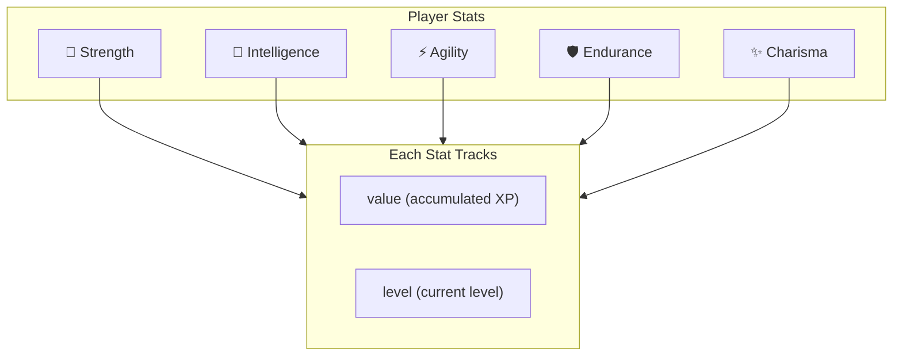
```mermaid
graph TD
    subgraph Stats["Player Stats"]
        STR["💪 Strength"]
        INT["🧠 Intelligence"]
        AGI["⚡ Agility"]
        END["🛡️ Endurance"]
        CHA["✨ Charisma"]
    end

    subgraph Each["Each Stat Tracks"]
        V["value (accumulated XP)"]
        L["level (current level)"]
    end

    STR --> Each
    INT --> Each
    AGI --> Each
    END --> Each
    CHA --> Each
```

### Rank Hierarchy

```
   S ──── Shadow Monarch (2200+ Hunter Score)
   │
   A ──── Elite Hunter (1500+)
   │
   B ──── Veteran Hunter (1000+)
   │
   C ──── Skilled Hunter (600+)
   │
   D ──── Trained Hunter (300+)
   │
   E ──── Novice Hunter (0+) ← Starting rank
```

---

## Leveling System — Deep Dive

### XP Threshold Formula

Both user levels and stat levels use the same polynomial curve generator with different parameters:

```javascript
function generateThresholds(maxLevel, baseXP, exponent, offset) {
    let xp = baseXP;
    for (let level = 1; level <= maxLevel; level++) {
        thresholds[level] = Math.floor(xp);
        xp += Math.floor(Math.pow(level + offset, exponent)) + 10;
    }
}

// Stat levels — gentler curve
statLevelThresholds = generateThresholds(169, baseXP=20, exponent=2.1);

// User levels — steeper curve  
userLevelThresholds = generateThresholds(169, baseXP=40, exponent=2.3);
```

### How Level-Up Works (Threshold Model)

XP is **subtracted** on level-up, not cumulative. The system loops until XP is below the next threshold:

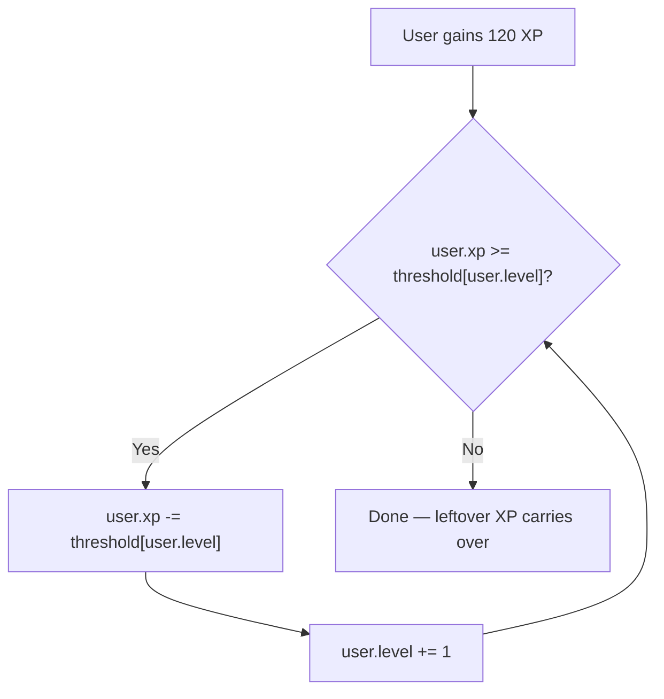
```mermaid
flowchart TD
    A["User gains 120 XP"] --> B{"user.xp >= threshold[user.level]?"}
    B -->|Yes| C["user.xp -= threshold[user.level]"]
    C --> D["user.level += 1"]
    D --> B
    B -->|No| E["Done — leftover XP carries over"]
```

**Example**: User at Level 3 with 0 XP gains 500 XP.
- Level 3 threshold = 51 → subtract 51, level = 4, xp = 449
- Level 4 threshold = 73 → subtract 73, level = 5, xp = 376
- Level 5 threshold = 100 → subtract 100, level = 6, xp = 276
- ... continues until XP < next threshold

### Sample Thresholds

| Level | Stat XP Required | User XP Required |
|-------|-----------------|------------------|
| 1 | 20 | 40 |
| 5 | 100 | 175 |
| 10 | 320 | 620 |
| 20 | 1,200 | 2,800 |
| 50 | 8,500 | 25,000 |
| 100 | 40,000 | 150,000 |
| 169 (max) | ~160,000 | ~700,000 |

> **Design Decision**: The threshold (subtraction) model means a Level 50 user and a Level 5 user both start each level with "0 XP towards next level." This makes the progress bar meaningful at every level, unlike cumulative models where early levels feel instant.

---

## Mission & Quest System

### Entity Relationships

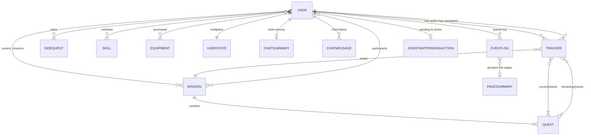
```mermaid
erDiagram
    USER ||--o{ TRACKER : "has active"
    USER ||--o{ TRACKER : "has completed"
    USER }o--o{ MISSION : "current_missions"
    USER ||--o{ SIDEQUEST : "owns"
    USER }o--o{ SKILL : "unlocked"
    USER }o--o{ EQUIPMENT : "purchased"
    
    MISSION ||--|{ QUEST : "contains"
    MISSION }o--o{ USER : "participants"
    
    TRACKER }o--|| MISSION : "tracks"
    TRACKER }o--|{ QUEST : "currentQuests"
    TRACKER }o--|{ QUEST : "remainingQuests"
    
    USER ||--|| USERSTATE : "multipliers"
    USER ||--o| CHATSUMMARY : "chat memory"
    USER ||--o{ CHATMESSAGE : "chat history"
    USER ||--o{ EVENTLOG : "activity log"
    USER ||--o| ASSISTANTPENDINGACTION : "pending AI action"
    
    EVENTLOG }o--o| PAGESUMMARY : "grouped into pages"
```

### Mission Lifecycle

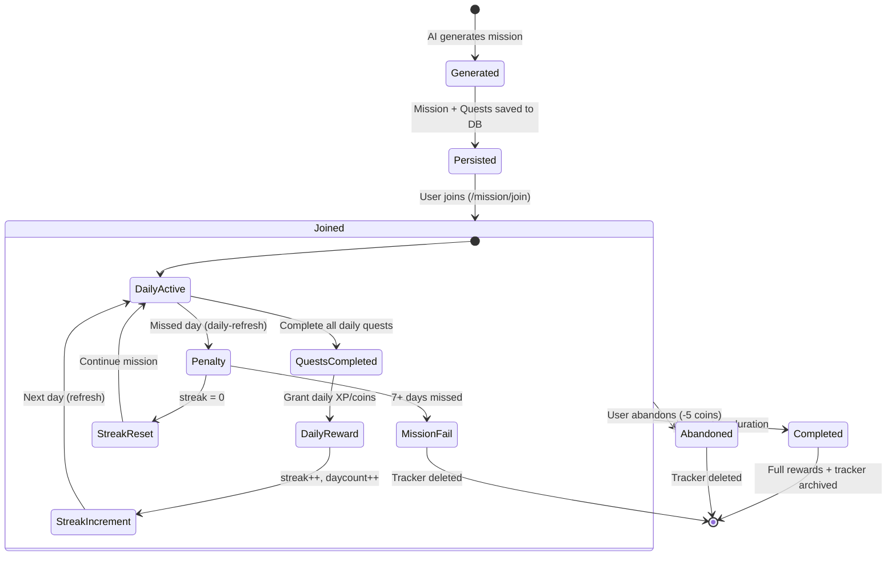
```mermaid
stateDiagram-v2
    [*] --> Generated: AI generates mission
    Generated --> Persisted: Mission + Quests saved to DB
    Persisted --> Joined: User joins (/mission/join)
    
    state Joined {
        [*] --> DailyActive
        DailyActive --> QuestsCompleted: Complete all daily quests
        QuestsCompleted --> DailyReward: Grant daily XP/coins
        DailyReward --> StreakIncrement: streak++, daycount++
        StreakIncrement --> DailyActive: Next day (refresh)
        
        DailyActive --> Penalty: Missed day (daily-refresh)
        Penalty --> StreakReset: streak = 0
        StreakReset --> DailyActive: Continue mission
        
        Penalty --> MissionFail: 7+ days missed
    }
    
    Joined --> Completed: daycount >= duration
    Joined --> Abandoned: User abandons (-5 coins)
    MissionFail --> [*]: Tracker deleted
    Completed --> [*]: Full rewards + tracker archived
    Abandoned --> [*]: Tracker deleted
```

### Quest Completion — Full Sequence

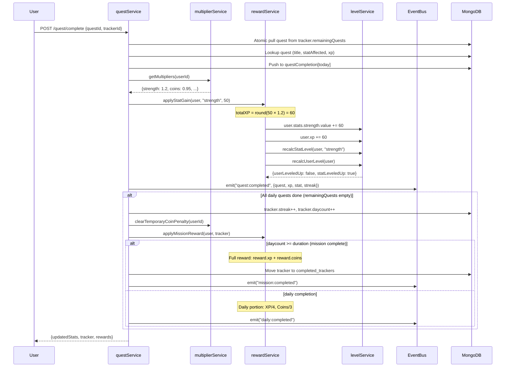
```mermaid
sequenceDiagram
    participant U as User
    participant QS as questService
    participant MS as multiplierService
    participant RS as rewardService
    participant LS as levelService
    participant EB as EventBus
    participant DB as MongoDB

    U->>QS: POST /quest/complete {questId, trackerId}
    
    QS->>DB: Atomic pull quest from tracker.remainingQuests
    QS->>DB: Lookup quest (title, statAffected, xp)
    QS->>DB: Push to questCompletion[today]
    
    QS->>MS: getMultipliers(userId)
    MS-->>QS: {strength: 1.2, coins: 0.95, ...}
    
    QS->>RS: applyStatGain(user, "strength", 50)
    Note over RS: totalXP = round(50 × 1.2) = 60
    RS->>LS: user.stats.strength.value += 60
    RS->>LS: user.xp += 60
    RS->>LS: recalcStatLevel(user, "strength")
    RS->>LS: recalcUserLevel(user)
    LS-->>RS: {userLeveledUp: false, statLeveledUp: true}
    
    QS->>EB: emit("quest:completed", {quest, xp, stat, streak})
    
    alt All daily quests done (remainingQuests empty)
        QS->>DB: tracker.streak++, tracker.daycount++
        QS->>MS: clearTemporaryCoinPenalty(userId)
        QS->>RS: applyMissionReward(user, tracker)
        
        alt daycount >= duration (mission complete)
            Note over RS: Full reward: reward.xp + reward.coins
            QS->>DB: Move tracker to completed_trackers
            QS->>EB: emit("mission:completed")
        else daily completion
            Note over RS: Daily portion: XP/4, Coins/3
            QS->>EB: emit("daily:completed")
        end
    end
    
    QS-->>U: {updatedStats, tracker, rewards}
```

### Daily Refresh & Penalty Flow

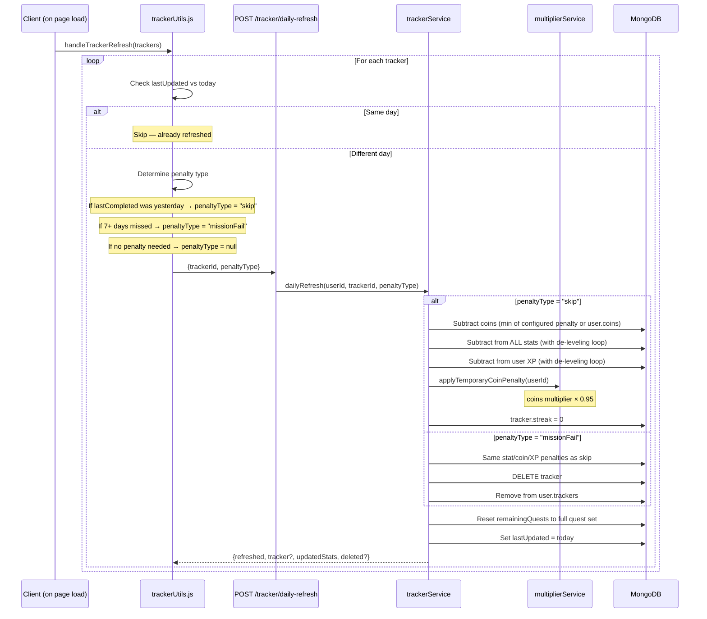
```mermaid
sequenceDiagram
    participant App as Client (on page load)
    participant TU as trackerUtils.js
    participant API as POST /tracker/daily-refresh
    participant TS as trackerService
    participant MS as multiplierService
    participant DB as MongoDB

    App->>TU: handleTrackerRefresh(trackers)
    
    loop For each tracker
        TU->>TU: Check lastUpdated vs today
        
        alt Same day
            Note over TU: Skip — already refreshed
        else Different day
            TU->>TU: Determine penalty type
            Note over TU: If lastCompleted was yesterday → penaltyType = "skip"
            Note over TU: If 7+ days missed → penaltyType = "missionFail"
            Note over TU: If no penalty needed → penaltyType = null
            
            TU->>API: {trackerId, penaltyType}
            API->>TS: dailyRefresh(userId, trackerId, penaltyType)
            
            alt penaltyType = "skip"
                TS->>DB: Subtract coins (min of configured penalty or user.coins)
                TS->>DB: Subtract from ALL stats (with de-leveling loop)
                TS->>DB: Subtract from user XP (with de-leveling loop)
                TS->>MS: applyTemporaryCoinPenalty(userId)
                Note over MS: coins multiplier × 0.95
                TS->>DB: tracker.streak = 0
            else penaltyType = "missionFail"
                TS->>DB: Same stat/coin/XP penalties as skip
                TS->>DB: DELETE tracker
                TS->>DB: Remove from user.trackers
            end
            
            TS->>DB: Reset remainingQuests to full quest set
            TS->>DB: Set lastUpdated = today
            TS-->>TU: {refreshed, tracker?, updatedStats, deleted?}
        end
    end
```

### De-Leveling Algorithm (Reverse Level)

When penalties are applied, stat values can go negative. The system handles this by **reverse-leveling**:

```javascript
// Subtract penalty from stat, de-level if needed
user.stats[stat].value -= penaltyAmount;

while (user.stats[stat].value < 0 && user.stats[stat].level > 1) {
    user.stats[stat].level -= 1;
    // Add back the threshold of the level we just dropped to
    user.stats[stat].value += statLevelThresholds[user.stats[stat].level];
}

// Same pattern for user XP/level
user.xp -= xpPenalty;
while (user.xp < 0 && user.level > 1) {
    user.level -= 1;
    user.xp += userLevelThresholds[user.level];
}
```

> **Design Decision**: De-leveling is the Solo Leveling "risk" mechanic. Missing quests has real consequences — you can lose levels. This creates genuine stakes for maintaining streaks.

---

## Reward & Economy System

### XP Distribution

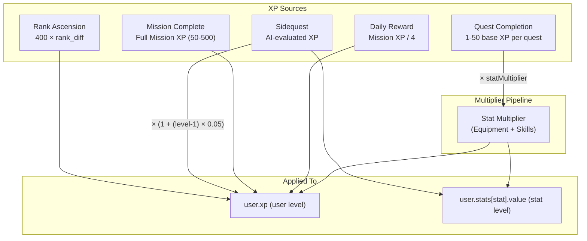
```mermaid
graph TD
    subgraph Sources["XP Sources"]
        QC["Quest Completion<br/>1-50 base XP per quest"]
        DR["Daily Reward<br/>Mission XP / 4"]
        MR["Mission Complete<br/>Full Mission XP (50-500)"]
        SR["Sidequest<br/>AI-evaluated XP"]
        RA["Rank Ascension<br/>400 × rank_diff"]
    end

    subgraph Pipeline["Multiplier Pipeline"]
        SM["Stat Multiplier<br/>(Equipment + Skills)"]
    end

    subgraph Targets["Applied To"]
        UX["user.xp (user level)"]
        SV["user.stats[stat].value (stat level)"]
    end

    QC -->|"× statMultiplier"| SM
    SM --> UX
    SM --> SV
    DR --> UX
    MR --> UX
    SR -->|"× (1 + (level-1) × 0.05)"| UX
    SR --> SV
    RA --> UX
```

### Coin Economy

| Source | Amount | Multiplied? |
|--------|--------|-------------|
| Daily quest completion | `mission.reward.coins / 3` | ✅ `× coinMultiplier` |
| Mission completion | `mission.reward.coins` | ✅ `× coinMultiplier` |
| Sidequest completion | AI-evaluated (5-50) | ✅ `× coinMultiplier × (1 + (level-1) × 0.05)` |
| Rank ascension | `1500 × rank_diff` | ❌ Raw |

| Sink | Amount |
|------|--------|
| Equipment purchase | Equipment cost (varies) |
| Mission abandonment | `min(5, user.coins)` flat fee |
| Skip penalty | Configured per-mission (1-20 coins) |
| Mission fail penalty | Configured per-mission (5-50 coins) |
| Temporary coin penalty | −5% multiplier on streak break |

### Multiplier Stacking


```mermaid
graph LR
    subgraph Base["Base Multiplier"]
        B["1.0 for each stat + coins"]
    end

    subgraph Equipment["Equipment Effects (Additive)"]
        E1["Shadow Gauntlets: strength +0.1"]
        E2["Ring of Power: ALL stats +0.05"]
        E3["Merchant's Amulet: coins +0.15"]
    end

    subgraph Skills["Skill Effects"]
        S1["Focus I: xp_multiplier 1.1 (multiplicative)"]
        S2["Coin Sense: coin_multiplier 1.2 (multiplicative)"]
        S3["STR Mastery: stat_bonus strength +0.2 (additive)"]
    end

    subgraph Penalty["Temporary Penalties"]
        P1["Streak break: coins × 0.95"]
    end

    Base --> Equipment --> Skills --> Penalty
    
    Penalty --> Final["Final Multipliers<br/>strength: 1.0 + 0.1 + 0.05 + 0.2 = 1.35 × 1.1 = 1.485<br/>coins: 1.0 + 0.15 = 1.15 × 1.2 = 1.38 × 0.95 = 1.311"]
```

**Order of operations**:
1. Start at 1.0
2. Add all equipment flat bonuses (additive)
3. Apply skill `xp_multiplier` effects (multiplicative)
4. Apply skill `stat_bonus` effects (additive)
5. If `coinPenaltyActive`, multiply coins × 0.95

---

## Rank Ascension System

### Hunter Score Formula

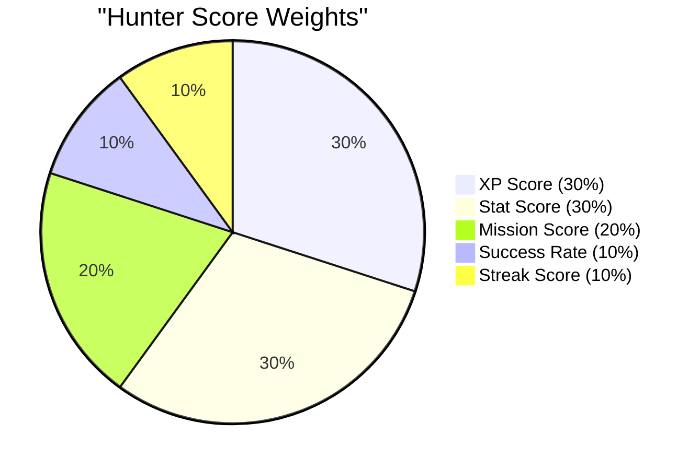
```mermaid
pie title "Hunter Score Weights"
    "XP Score (30%)" : 30
    "Stat Score (30%)" : 30
    "Mission Score (20%)" : 20
    "Success Rate (10%)" : 10
    "Streak Score (10%)" : 10
```

```
xpScore      = user.xp × 0.3
statScore    = (sum of all stat levels) × 10 × 0.3
missionScore = totalMissions × 20 × 0.2
successScore = (completed / total trackers) × 100 × 0.1
streakScore  = averageStreak × 5 × 0.1

Hunter Score = xpScore + statScore + missionScore + successScore + streakScore
```

### Rank Thresholds & Rewards

| Rank | Threshold | XP Reward (per jump) | Coin Reward | Title Earned |
|------|-----------|---------------------|-------------|-------------|
| E | 0 | — | — | — |
| D | 300 | 400 | 1,500 | "D-Rank Hunter" |
| C | 600 | 400 | 1,500 | "C-Rank Hunter" |
| B | 1,000 | 400 | 1,500 | "B-Rank Hunter" |
| A | 1,500 | 400 | 1,500 | "A-Rank Hunter" |
| S | 2,200 | 400 | 1,500 | "S-Rank Hunter" |

> Multi-rank jumps multiply the reward (e.g., E→B = 3 jumps = 1200 XP, 4500 coins).

---

## Adaptive Quest Upgrade System

When a player reaches **streak ≥ 5**, they can upgrade their quests to harder versions:

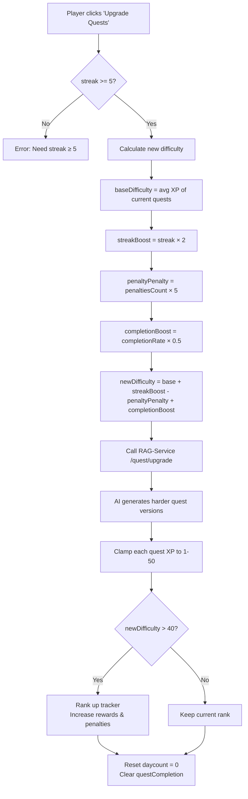
```mermaid
flowchart TD
    A["Player clicks 'Upgrade Quests'"] --> B{"streak >= 5?"}
    B -->|No| C["Error: Need streak ≥ 5"]
    B -->|Yes| D["Calculate new difficulty"]
    
    D --> E["baseDifficulty = avg XP of current quests"]
    E --> F["streakBoost = streak × 2"]
    F --> G["penaltyPenalty = penaltiesCount × 5"]
    G --> H["completionBoost = completionRate × 0.5"]
    H --> I["newDifficulty = base + streakBoost - penaltyPenalty + completionBoost"]
    
    I --> J["Call RAG-Service /quest/upgrade"]
    J --> K["AI generates harder quest versions"]
    K --> L["Clamp each quest XP to 1-50"]
    
    L --> M{"newDifficulty > 40?"}
    M -->|Yes| N["Rank up tracker<br/>Increase rewards & penalties"]
    M -->|No| O["Keep current rank"]
    
    N --> P["Reset daycount = 0<br/>Clear questCompletion"]
    O --> P
```

### Rank-Up Reward Scaling

| Field | Per Rank-Up | Max |
|-------|-------------|-----|
| `reward.xp` | +50 | 500 |
| `reward.coins` | +10 | 100 |
| `penalty.missionFail.coins` | +5 | 50 |
| `penalty.missionFail.stats` | +1 | 5 |
| `penalty.skip.coins` | +2 | 20 |
| `penalty.skip.stats` | +1 | 2 |
| Special reward (rank ≥ B) | `['common', 'rare', 'epic']` | — |

---

## Title & Achievement System

### Title Requirements

Titles are unlocked when the player meets ALL requirements:

| Requirement Type | Check |
|-----------------|-------|
| `level` | `user.level >= value` |
| `missionsCompleted` | `user.completed_trackers.length >= value` |
| `streak` | Any tracker with `streak >= value` |
| `coins` | `user.coins >= value` |
| `statTotal` | Specific stat value OR sum of all stats ≥ value |
| `statLevel` | `user.stats[stat].level >= value` |
| `rank` | Rank index ≥ required rank index |

### Default Titles (12)

| Title | Key Requirement | Tier |
|-------|----------------|------|
| Novice Hunter | Level 1 | 1 |
| Apprentice of Shadows | 3 missions completed | 1 |
| Iron Challenger | Level 5 | 2 |
| Streak Adept | 5 streak | 2 |
| Coin Hoarder | 200 coins | 2 |
| Stat Specialist: Strength | STR level 10 | 3 |
| Rising Monarch | Rank C | 3 |
| Shadow Strategist | INT value 500 | 3 |
| Relentless | 15 missions completed | 4 |
| Arcane Ascendant | Level 20 | 4 |
| Unbroken Chain | 20 streak | 5 |
| Shadow Monarch | Rank A + Level 35 | 5 |

---

## Equipment & Skill Systems

### Equipment Model

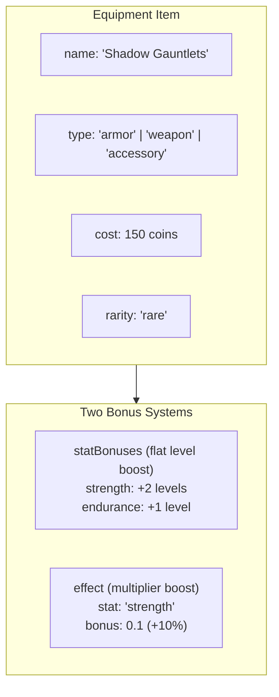
```mermaid
graph TD
    subgraph Equipment["Equipment Item"]
        Name["name: 'Shadow Gauntlets'"]
        Type["type: 'armor' | 'weapon' | 'accessory'"]
        Cost["cost: 150 coins"]
        Rarity["rarity: 'rare'"]
    end

    subgraph Effects["Two Bonus Systems"]
        SB["statBonuses (flat level boost)<br/>strength: +2 levels<br/>endurance: +1 level"]
        EF["effect (multiplier boost)<br/>stat: 'strength'<br/>bonus: 0.1 (+10%)"]
    end

    Equipment --> Effects
```

**Purchase flow**: Check ownership → check balance → deduct coins → apply `statBonuses` as flat stat level increases → recalculate multipliers → emit event.

### Skill Model

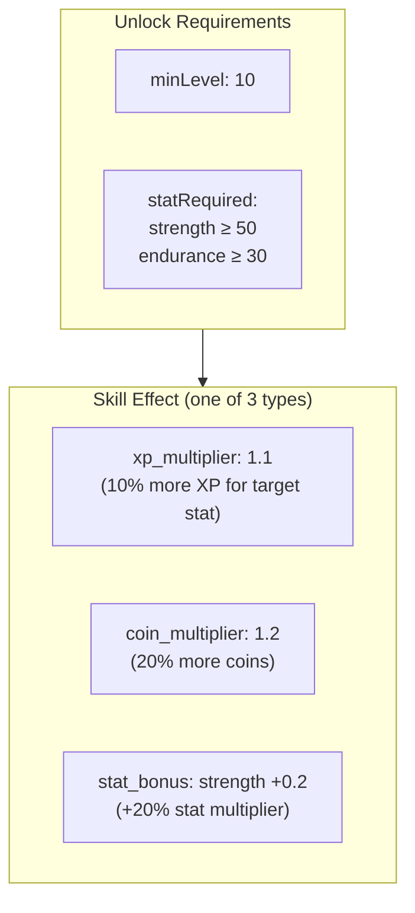
```mermaid
graph TD
    subgraph Unlock["Unlock Requirements"]
        ML["minLevel: 10"]
        SR["statRequired:<br/>strength ≥ 50<br/>endurance ≥ 30"]
    end

    subgraph Effect["Skill Effect (one of 3 types)"]
        XP["xp_multiplier: 1.1<br/>(10% more XP for target stat)"]
        CM["coin_multiplier: 1.2<br/>(20% more coins)"]
        SB2["stat_bonus: strength +0.2<br/>(+20% stat multiplier)"]
    end

    Unlock --> Effect
```

**Unlock flow**: Check duplicate → check level requirement → check stat requirements → push to user.skills → recalculate multipliers → emit event.

---

## Sidequest System

Sidequests are standalone, one-off tasks that are **AI-evaluated** for difficulty:

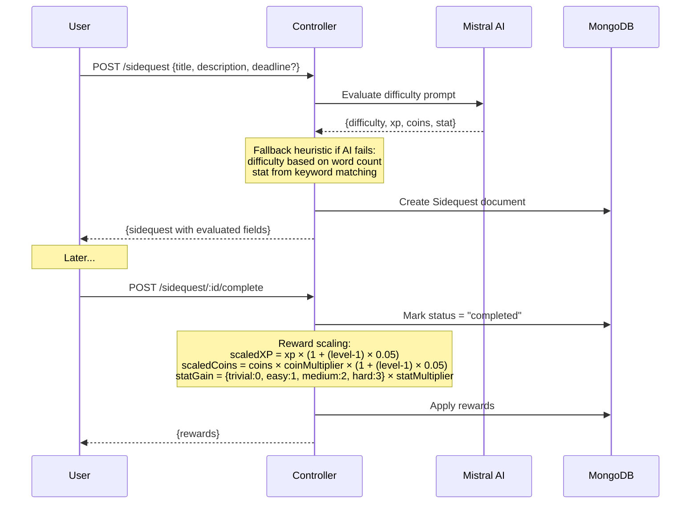
```mermaid
sequenceDiagram
    participant U as User
    participant C as Controller
    participant AI as Mistral AI
    participant DB as MongoDB

    U->>C: POST /sidequest {title, description, deadline?}
    C->>AI: Evaluate difficulty prompt
    AI-->>C: {difficulty, xp, coins, stat}
    
    Note over C: Fallback heuristic if AI fails:<br/>difficulty based on word count<br/>stat from keyword matching

    C->>DB: Create Sidequest document
    C-->>U: {sidequest with evaluated fields}

    Note over U: Later...

    U->>C: POST /sidequest/:id/complete
    C->>DB: Mark status = "completed"
    
    Note over C: Reward scaling:<br/>scaledXP = xp × (1 + (level-1) × 0.05)<br/>scaledCoins = coins × coinMultiplier × (1 + (level-1) × 0.05)<br/>statGain = {trivial:0, easy:1, medium:2, hard:3} × statMultiplier
    
    C->>DB: Apply rewards
    C-->>U: {rewards}
```

---

## Database Schema — All 14 Models

### Model Overview

| Model | File | Fields | Key Features |
|-------|------|--------|-------------|
| **User** | `user.js` | 22 | Central profile. Refs to 5 other models. |
| **Mission** | `mission.js` | 10 | Template. Has quests[], participants[], reward/penalty. |
| **Quest** | `quest.js` | 3 | Atomic unit: title, statAffected, xp. |
| **Tracker** | `tracker.js` | 20+ | Active mission instance. Denormalizes mission data. |
| **Equipment** | `inventory.js` | 9 | Shop items. Two bonus systems (statBonuses + effect). |
| **Skill** | `skill.js` | 7 | Unlockable abilities with stat/level requirements. |
| **Title** | `title.js` | 7 | Achievement titles with complex requirement rules. |
| **Sidequest** | `sidequests.js` | 9 | Standalone tasks with AI-evaluated difficulty. |
| **UserState** | `userState.js` | 4 | Per-user multipliers and temporary penalty state. |
| **ChatMessage** | `chatHistory.js` | 4 | Individual chat messages (30-day TTL auto-delete). |
| **ChatSummary** | `chatHistory.js` | 4 | Rolling chat summary (1:1 with User). |
| **EventLog** | `eventLog.js` | 6 | Every user action, grouped into pages of 20. |
| **PageSummary** | `eventLog.js` | 8 | LLM-generated summaries of event pages, embedded in Pinecone. |
| **AssistantPendingAction** | `assistantPendingAction.js` | 5 | Pending AI-proposed mission (2-hour TTL). |

### User Model (Core)

```
User {
    username: String
    email: String
    password: String (bcrypt hashed)
    level: Number (default: 1)
    xp: Number (default: 0)
    rank: Enum ['E','D','C','B','A','S'] (default: 'E')
    stats: {
        strength:     { value: Number, level: Number }
        intelligence: { value: Number, level: Number }
        agility:      { value: Number, level: Number }
        endurance:    { value: Number, level: Number }
        charisma:     { value: Number, level: Number }
    }
    coins: Number (default: 0)
    totalMission: Number
    titles: [String]
    activeTitle: String
    achievements: [String]
    skills: [ObjectId → Skill]
    equiments: [ObjectId → Equipment]         ← typo preserved from codebase
    current_missions: [ObjectId → Mission]
    trackers: [ObjectId → Tracker]
    completed_trackers: [ObjectId → Tracker]
    sidequests: [ObjectId → Sidequest]
    avatar: String (Cloudinary URL)
    googleId: String (OAuth)
    lastRankCheck: Date
}
```

### Tracker Model (Mission Instance)

The Tracker is the most complex model — it's a **denormalized snapshot** of a mission frozen at join time:

```
Tracker {
    userId: ObjectId → User
    missionId: ObjectId → Mission
    
    // Quest management
    currentQuests: [ObjectId → Quest]       ← today's assigned quests
    remainingQuests: [ObjectId → Quest]     ← quests left for today
    questCompletion: Map<dateString, [ObjectId → Quest]>   ← history by day
    
    // Progress tracking
    streak: Number (default: 0)             ← consecutive days completed
    daycount: Number (default: 0)           ← total days completed
    lastUpdated: Date                       ← last daily refresh
    lastCompleted: Date                     ← last full daily completion
    lastStreakReset: Date
    completedDays: [Date]
    penaltiesApplied: [Date]
    rewardsClaimed: Boolean
    failed: Boolean
    
    // Denormalized from Mission (frozen at join time)
    title: String
    description: String
    duration: Number (days)
    reward: { xp, coins, specialReward }
    penalty: {
        missionFail: { coins, stats }       ← applied on 7+ days missed
        skip: { coins, stats }              ← applied on each missed day
    }
    rank: Enum ['E','D','C','B','A','S']
}
```

> **Design Decision**: Mission fields are flattened into the Tracker so that if the original Mission changes (e.g., updated by AI upgrade), the user's in-progress tracker keeps the values they agreed to when joining.

### Key Database Indexes

| Model | Index | Purpose |
|-------|-------|---------|
| ChatMessage | `{userId: 1, timestamp: -1}` | Fast retrieval of recent messages |
| ChatMessage | `{timestamp: 1}` TTL 30 days | Auto-delete old messages |
| EventLog | `{userId: 1, timestamp: -1}` | Recent events for RAG context |
| EventLog | `{userId: 1, pageIndex: 1}` | Page building queries |
| PageSummary | `{userId: 1, pageIndex: 1}` unique | One summary per page per user |
| AssistantPendingAction | `{expiresAt: 1}` TTL 0 | Auto-expire pending missions |
| UserState | `{userId: 1}` unique | 1:1 multiplier lookup |
| Title | `{name: 1}` unique | No duplicate titles |

---

## REST API Reference

### Authentication (Public)

| Method | Path | Rate Limit | Description |
|--------|------|-----------|-------------|
| POST | `/auth/register` | 10/15min | Register with email/password. Sets JWT cookie. |
| POST | `/auth/login` | 10/15min | Login with email/password. Sets JWT cookie. |
| POST | `/auth/google` | — | Google OAuth (ID token or access token). |
| GET | `/auth/logout` | — | Clears JWT cookie. |
| GET | `/auth/test` | — | Validates JWT. Returns `{success: true}`. |

### Missions (Auth Required)

| Method | Path | Description |
|--------|------|-------------|
| POST | `/mission/create` | AI-generates mission from description + days. |
| POST | `/mission/createCustom` | Creates mission from user-provided tasks. |
| POST | `/mission/join` | Joins a mission → creates Tracker. |
| POST | `/mission/upgrade` | Upgrades tracker quests (streak ≥ 5). |
| POST | `/mission/delete` | Deletes a mission. |

### Quests (Auth + Validated)

| Method | Path | Validation | Description |
|--------|------|-----------|-------------|
| POST | `/quest/complete` | Zod schema | Completes quest → XP/stat/coin rewards. |

### Trackers (Auth Required)

| Method | Path | Description |
|--------|------|-------------|
| POST | `/tracker/daily-refresh` | Refreshes daily quests, applies penalties. |
| DELETE | `/tracker/:id` | Deletes a tracker. |
| POST | `/tracker/:id/abandon` | Abandons mission (−5 coin fee). |

### Shop & Skills (Auth + Validated)

| Method | Path | Description |
|--------|------|-------------|
| POST | `/inventory/buy` | Purchase equipment with coins. |
| POST | `/skill/unlock` | Unlock a skill (requires stat/level). |

### Rank & Titles (Auth Required)

| Method | Path | Description |
|--------|------|-------------|
| GET | `/rank/ascension` | Evaluates hunter score, ascends if eligible. |
| GET | `/titles/` | Lists all titles with unlock status. |
| POST | `/titles/unlock` | Auto-unlocks all eligible titles. |
| POST | `/titles/equip` | Sets active title. |

### Sidequests (Auth Required)

| Method | Path | Description |
|--------|------|-------------|
| POST | `/sidequest/` | Creates sidequest → AI evaluates difficulty. |
| GET | `/sidequest/` | Lists user's sidequests (optional `?status=` filter). |
| POST | `/sidequest/:id/complete` | Completes sidequest → scaled rewards. |

### User Profile & AI Assistant (Auth Required)

| Method | Path | Description |
|--------|------|-------------|
| PUT | `/user/profile` | Updates active title and/or avatar. |
| GET | `/assistant/history` | Gets chat history + summary. |
| POST | `/assistant/chat` | Sends message → AI reply + optional action. |
| DELETE | `/assistant/history` | Clears chat history. |

---

## GraphQL API Reference

All queries hit `/graphql`. Auth is via JWT cookie in the Apollo context.

| Query | Auth | Description |
|-------|------|-------------|
| `getUser` | ✅ Required | Full user profile with nested stats, equipment, skills. |
| `getUserTrackers` | ✅ Required | All active trackers for the user. |
| `getTrackerById(id)` | ✅ Required | Single tracker with populated quests. |
| `getSidequests(status?)` | ✅ Required | User's sidequests, optionally filtered. |
| `getPublicMissions` | ❌ Public | All missions with `public: true`. |
| `getAllSkills` | ❌ Public | All skills in the database. |
| `getSkillById(id)` | ❌ Public | Single skill by ID. |
| `getAllEquipment` | ❌ Public | All equipment items. |
| `getEquipmentById(id)` | ❌ Public | Single equipment by ID. |
| `leaderboard(limit, sortBy)` | ❌ Public | Top users sorted by xp/level/coins/totalMission. |

### Field Resolvers

```
User.trackers → populates Tracker subdocuments
User.skills → populates Skill subdocuments
User.equiments → populates Equipment subdocuments
User.multipliers → computed via getMultipliers(userId)
Tracker.currentQuests → populates Quest subdocuments
Tracker.remainingQuests → populates Quest subdocuments
```

> **Design Decision**: GraphQL mutations were removed — all mutations go through REST. This keeps the write path simple (REST controllers → services → events) while GraphQL handles the complex nested reads it's designed for.

---

## Event-Driven Architecture

### Event Flow

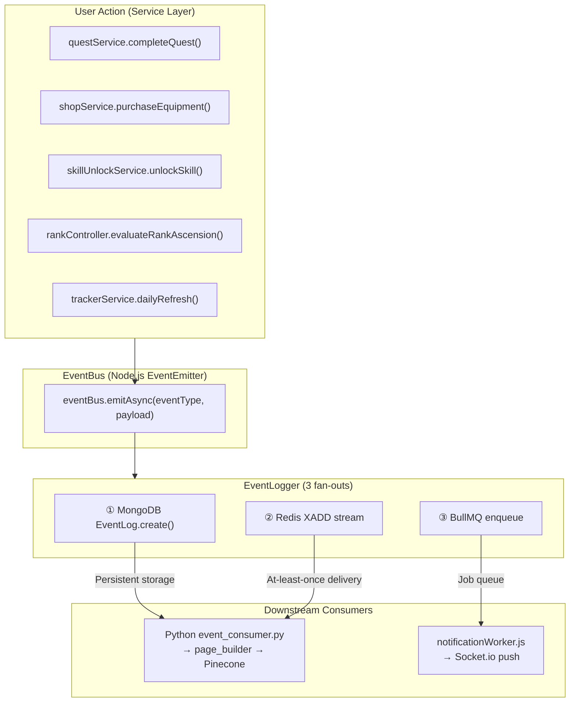
```mermaid
graph TD
    subgraph Trigger["User Action (Service Layer)"]
        QC["questService.completeQuest()"]
        SP["shopService.purchaseEquipment()"]
        SU["skillUnlockService.unlockSkill()"]
        RA["rankController.evaluateRankAscension()"]
        TR["trackerService.dailyRefresh()"]
    end

    subgraph Bus["EventBus (Node.js EventEmitter)"]
        EB["eventBus.emitAsync(eventType, payload)"]
    end

    subgraph Logger["EventLogger (3 fan-outs)"]
        direction TB
        DB["① MongoDB EventLog.create()"]
        RD["② Redis XADD stream"]
        BQ["③ BullMQ enqueue"]
    end

    subgraph Consumers["Downstream Consumers"]
        PY["Python event_consumer.py<br/>→ page_builder → Pinecone"]
        NW["notificationWorker.js<br/>→ Socket.io push"]
    end

    Trigger --> EB
    EB --> Logger
    DB -->|Persistent storage| PY
    RD -->|At-least-once delivery| PY
    BQ -->|Job queue| NW
```

### 11 Event Types

| Event | Triggered By | Payload Includes |
|-------|-------------|-----------------|
| `quest:completed` | questService | quest title, XP, stat, streak |
| `daily:completed` | questService | mission title, streak, day, XP, coins |
| `mission:completed` | questService | mission title |
| `mission:joined` | trackerService | mission title |
| `equipment:purchased` | shopService | name, cost, applied bonuses |
| `skill:unlocked` | skillUnlockService | skill name |
| `rank:ascended` | rankController | new rank, XP/coins reward |
| `penalty:applied` | trackerService | mission title, penalty type, stat/coin loss |
| `sidequest:completed` | sidequestController | title, difficulty, stat |
| `sidequest:created` | sidequestController | title, difficulty, stat |
| `title:unlocked` | titleController | title name |

### Notification Worker (BullMQ → Socket.io)

The notification worker consumes events from the `system2-events` queue and pushes them to the user's WebSocket room:

```
Queue: "system2-events"
Concurrency: 5
Retries: 3 (exponential backoff)
Keeps: 100 completed / 500 failed jobs

Message format to client:
{
    type: "quest:completed",
    title: "Quest Completed! 💪",
    message: "You completed Push-ups +50 XP",
    data: { ... original event payload }
}
```

---

## Frontend Architecture

### Component Tree

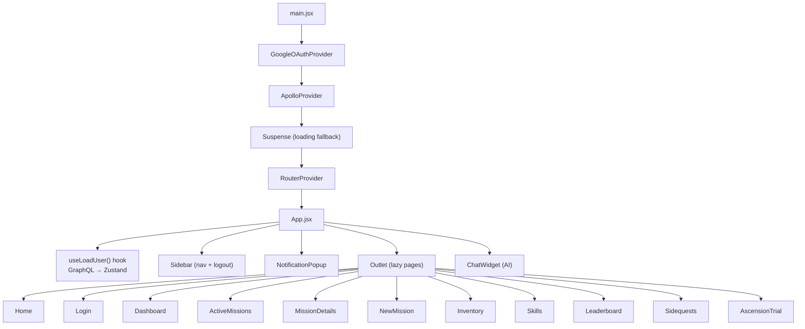
```mermaid
graph TD
    Main["main.jsx"] --> GOP["GoogleOAuthProvider"]
    GOP --> AP["ApolloProvider"]
    AP --> SUS["Suspense (loading fallback)"]
    SUS --> RP["RouterProvider"]
    RP --> App["App.jsx"]
    
    App --> UL["useLoadUser() hook<br/>GraphQL → Zustand"]
    App --> SB["Sidebar (nav + logout)"]
    App --> NP["NotificationPopup"]
    App --> Outlet["Outlet (lazy pages)"]
    App --> CW["ChatWidget (AI)"]

    Outlet --> Home
    Outlet --> Login
    Outlet --> Dashboard
    Outlet --> ActiveMissions
    Outlet --> MissionDetails
    Outlet --> NewMission
    Outlet --> Inventory
    Outlet --> Skills
    Outlet --> Leaderboard
    Outlet --> Sidequests
    Outlet --> AscensionTrial
```

### Route Map

| Path | Page | Protection | Data Source |
|------|------|-----------|-------------|
| `/` | Home | Public | Static |
| `/login` | Login | Guest-only | REST auth |
| `/signup` | Signup | Guest-only | REST auth |
| `/dashboard` | Dashboard | 🔒 Protected | Zustand + REST (titles, profile) |
| `/missions` | ActiveMissions | 🔒 Protected | Zustand trackerStore |
| `/missions/:id` | MissionDetails | 🔒 Protected | GraphQL GetTrackerById + REST |
| `/add-mission` | NewMission | 🔒 Protected | REST (AI generation) |
| `/add-custom` | AddCustomMission | 🔒 Protected | REST (custom creation) |
| `/report` | AscensionTrial | 🔒 Protected | REST (ascension report) |
| `/skills` | SkillPage | 🔒 Protected | GraphQL getAllSkills + REST |
| `/inventory` | Inventory | 🔒 Protected | GraphQL GET_ALL_EQUIPMENT + REST |
| `/leaderboard` | Leaderboard | 🔒 Protected | GraphQL GET_LEADERBOARD |
| `/sidequests` | Sidequests | 🔒 Protected | GraphQL GET_SIDEQUESTS + REST |

### State Management — 3 Zustand Stores

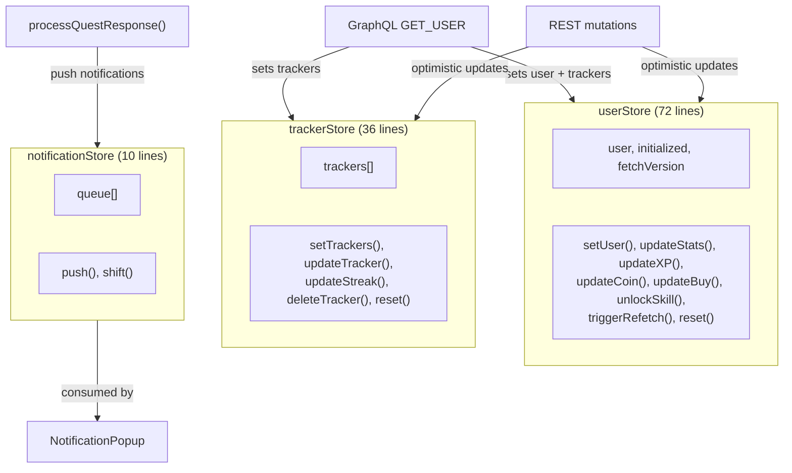
```mermaid
graph TD
    subgraph US["userStore (72 lines)"]
        U_Fields["user, initialized, fetchVersion"]
        U_Actions["setUser(), updateStats(), updateXP(),<br/>updateCoin(), updateBuy(), unlockSkill(),<br/>triggerRefetch(), reset()"]
    end

    subgraph TS["trackerStore (36 lines)"]
        T_Fields["trackers[]"]
        T_Actions["setTrackers(), updateTracker(),<br/>updateStreak(), deleteTracker(), reset()"]
    end

    subgraph NS["notificationStore (10 lines)"]
        N_Fields["queue[]"]
        N_Actions["push(), shift()"]
    end

    GQL["GraphQL GET_USER"] -->|"sets user + trackers"| US
    GQL -->|"sets trackers"| TS
    REST["REST mutations"] -->|"optimistic updates"| US
    REST -->|"optimistic updates"| TS
    Notify["processQuestResponse()"] -->|"push notifications"| NS
    NS -->|"consumed by"| NP["NotificationPopup"]
```

> **Key Pattern**: Stores are accessed both **reactively** (via hooks in components) and **imperatively** (via `useXxxStore.getState()`) from utilities like `processQuestres.js` and `trackerUtils.js`.

### Authentication Flow

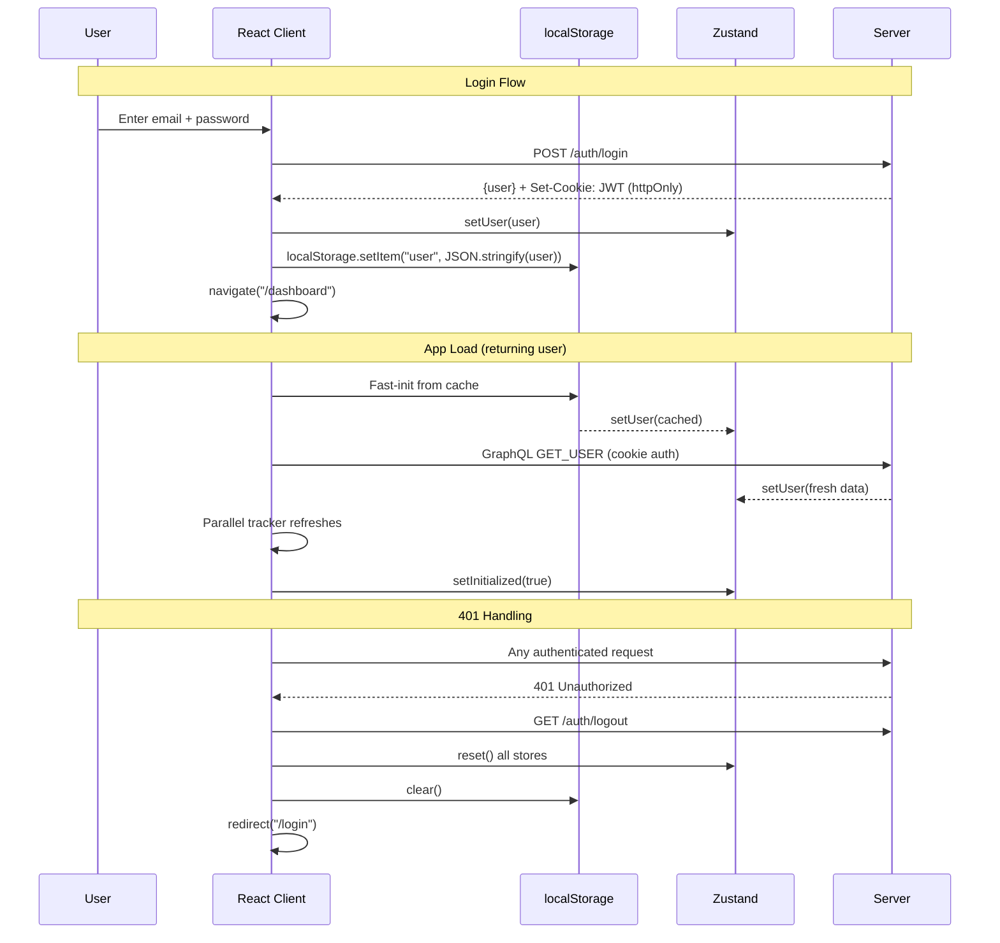
```mermaid
sequenceDiagram
    participant U as User
    participant C as React Client
    participant LS as localStorage
    participant Z as Zustand
    participant S as Server

    Note over U,S: Login Flow
    U->>C: Enter email + password
    C->>S: POST /auth/login
    S-->>C: {user} + Set-Cookie: JWT (httpOnly)
    C->>Z: setUser(user)
    C->>LS: localStorage.setItem("user", JSON.stringify(user))
    C->>C: navigate("/dashboard")

    Note over U,S: App Load (returning user)
    C->>LS: Fast-init from cache
    LS-->>Z: setUser(cached)
    C->>S: GraphQL GET_USER (cookie auth)
    S-->>Z: setUser(fresh data)
    C->>C: Parallel tracker refreshes
    C->>Z: setInitialized(true)

    Note over U,S: 401 Handling
    C->>S: Any authenticated request
    S-->>C: 401 Unauthorized
    C->>S: GET /auth/logout
    C->>Z: reset() all stores
    C->>LS: clear()
    C->>C: redirect("/login")
```

### Page Breakdown

| Page | Lines | Key Features |
|------|-------|-------------|
| **Home** | 431 | Marketing landing. ECharts radar chart, particle effects, skills/artifacts showcase. |
| **Dashboard** | 503 | Hunter profile card, ECharts radar stats, equipment/skill strips. Profile edit modal with Cloudinary avatar upload. |
| **MissionDetails** | 525 | Quest checklist, countdown timer, calendar modal, streak upgrade panel, abandon confirmation dialog. |
| **Inventory** | 584 | Equipment shop. Paginated grid with rarity filters, search, sort by price. Purchase with coins. |
| **Skills** | 470 | Skill forge. Paginated grid with status/rank filters. Shows stat requirements + progress bars. |
| **AddCustomMission** | 552 | Manual mission builder with drag-reorder tasks and duration slider. |
| **Signup** | 369 | Email/password + Google OAuth. react-hook-form + yup validation. Particle animations. |
| **AscensionTrial** | 353 | Performance report with metrics cards and ECharts line/radar charts. |
| **NewMission** | 331 | AI mission generator. Enter goal + duration, AI creates mission in modal. |
| **Login** | 336 | Same pattern as Signup. |
| **Sidequests** | 317 | Quick daily tasks with difficulty-colored cards. Complete for scaled rewards. |
| **ActiveMissions** | 277 | Primary directive hero card + secondary missions grid from trackerStore. |
| **Leaderboard** | 137 | Sortable leaderboard table (XP, Level, Coins, Missions). |

---

## Service Layer Dependency Graph


```mermaid
graph TD
    subgraph Core["Core Libraries"]
        LEV["levelling.js<br/>(XP thresholds)"]
    end

    subgraph Services["Service Layer"]
        LS["levelService<br/>(recalcLevel, applyXPGain)"]
        RS2["rewardService<br/>(applyMissionReward, applyStatGain)"]
        MS2["multiplierService<br/>(getMultipliers, recalcMultipliers)"]
        QS["questService<br/>(completeQuest, upgradeTrackerQuests)"]
        TS["trackerService<br/>(joinMission, dailyRefresh, abandon)"]
        MSS["missionService<br/>(generateMission, createCustomMission)"]
        ShS["shopService<br/>(purchaseEquipment)"]
        SkS["skillUnlockService<br/>(unlockSkill)"]
        AS["assistantService<br/>(chat, getChatHistory)"]
        RAG["ragService<br/>(HTTP client to Python)"]
        RkS["rankService<br/>(evaluateHunterScore)"]
        AQ["adaptiveQuest.js<br/>(upgradeQuests)"]
    end

    LEV --> LS
    LS --> RS2
    MS2 --> RS2
    RS2 --> QS
    MS2 --> QS
    MS2 --> TS
    LEV --> TS
    MS2 --> ShS
    MS2 --> SkS
    RAG --> MSS
    RAG --> AS
    RAG --> AQ
    TS --> AS
    MSS --> AS

    style LEV fill:#2d5a27
    style RAG fill:#4a2d6b
```

---

## Key Design Decisions

### Why denormalize Mission → Tracker?
The Tracker copies mission fields (title, rewards, penalties, rank) at join time. If the mission template later changes (e.g., via AI quest upgrade), the user's in-progress tracker keeps the values they committed to. This is crucial for fairness — penalty rules can't change mid-mission.

### Why GraphQL for reads + REST for writes?
GraphQL eliminates N+1 queries on the read path — a single `GET_USER` query returns the user profile with populated equipment, skills, and trackers. The write path benefits from REST's simplicity: each action triggers a service → event → side-effect chain that would be awkward to model as a GraphQL mutation.

### Why threshold-based leveling (subtract on level-up)?
In cumulative models, reaching Level 50 requires ~700,000 total XP — the progress bar barely moves at high levels. The threshold model resets progress each level, keeping the UI meaningful. It also enables de-leveling: penalties can drop you below 0 XP and decrement your level.

### Why Zustand instead of React Context?
Three reasons: (1) No provider nesting hell — stores are plain JS singletons. (2) Imperative access via `getState()` works from non-React utilities like `trackerUtils.js`. (3) Selective re-renders — components subscribe to specific slices.

### Why a separate Python RAG-Service?
The AI pipeline (LangChain agents, Pinecone, Mistral) requires Python libraries with no Node.js equivalents. Rather than embedding Python in Node.js, it runs as a separate FastAPI microservice. Node.js communicates via HTTP through `ragService.js` with 60s timeouts and graceful degradation.

### Why Redis Streams instead of Pub/Sub?
Pub/Sub is fire-and-forget — if the RAG-Service is down when events fire, they're lost forever. Redis Streams with consumer groups provide **at-least-once delivery**, message persistence, and position tracking. Events queue up during downtime and are consumed on restart.

### Why pages of 20 events?
Individual events ("completed quest X") are too granular for semantic search. Grouping 20 events into a page and summarizing with LLM produces rich, searchable text like "focused on strength training with a 12-day streak." The page size balances granularity vs. embedding cost.

---

## File Map

### Node.js Server

| File | Lines | Purpose |
|------|-------|---------|
| `index.js` | — | Express entry point, route mounting, middleware chain |
| `config/db.js` | — | MongoDB connection (Mongoose) |
| **Controllers** | | |
| `Controllers/authController.js` | — | Register, login, Google OAuth, logout |
| `Controllers/missionController.js` | — | Create, join, upgrade, delete missions |
| `Controllers/questController.js` | — | Quest completion |
| `Controllers/trackerController.js` | — | Daily refresh, delete, abandon |
| `Controllers/shopController.js` | — | Equipment purchase |
| `Controllers/skillController.js` | — | Skill unlock |
| `Controllers/rankController.js` | 52 | Rank ascension evaluation |
| `Controllers/titleController.js` | 130 | Title list, unlock, equip, seed |
| `Controllers/sidequestController.js` | — | Sidequest CRUD + AI evaluation |
| `Controllers/assistantController.js` | 38 | AI chat endpoints |
| **Services** | | |
| `services/levelService.js` | 64 | Level-up loops for user + stats |
| `services/rewardService.js` | 85 | Mission/quest/sidequest reward calculations |
| `services/multiplierService.js` | 182 | Equipment/skill multiplier aggregation |
| `services/questService.js` | 131 | Quest completion orchestration |
| `services/trackerService.js` | 248 | Tracker lifecycle + penalty system |
| `services/missionService.js` | 93 | Mission creation orchestration |
| `services/shopService.js` | 74 | Equipment purchase flow |
| `services/skillUnlockService.js` | 66 | Skill unlock flow |
| `services/rankService.js` | 81 | Hunter score formula + rank ascension |
| `services/assistantService.js` | 288 | AI chat orchestration + pending actions |
| `services/ragService.js` | 258 | HTTP client to Python RAG-Service |
| **Libraries** | | |
| `libs/levelling.js` | 16 | XP threshold curve generator |
| `libs/adaptiveQuest.js` | 85 | Quest difficulty upgrade algorithm |
| **Events** | | |
| `events/eventBus.js` | 51 | Async EventEmitter (11 event types) |
| `events/eventLogger.js` | 91 | Event → MongoDB + Redis + BullMQ |
| **Infrastructure** | | |
| `queue/connection.js` | — | Redis/BullMQ connection factory |
| `queue/eventQueue.js` | — | BullMQ queue configuration |
| `workers/notificationWorker.js` | — | Event → Socket.io push |
| `socket/socketManager.js` | — | Socket.io JWT auth + room management |
| `graphql/typeDefs.js` | — | GraphQL schema definitions |
| `graphql/resolvers.js` | — | GraphQL query resolvers + field resolvers |

### React Client

| File | Lines | Purpose |
|------|-------|---------|
| `main.jsx` | — | Provider stack + router definition |
| `App.jsx` | — | Layout shell + useLoadUser |
| **State** | | |
| `store/userStore.js` | 72 | User profile + stats state |
| `store/trackerStore.js` | 36 | Active mission trackers |
| `store/notificationStore.js` | 10 | Toast notification queue |
| **Utils** | | |
| `utils/axios.js` | — | Axios instance + 401 interceptor |
| `utils/apollo.js` | — | Apollo Client configuration |
| `utils/levelling.js` | — | Client-side XP threshold tables (mirrors server) |
| `utils/processQuestres.js` | — | Post-action notification + store updates |
| `utils/trackerUtils.js` | — | Daily refresh logic (penalty detection) |
| `utils/userLoader.js` | — | useLoadUser hook (GraphQL + cache) |
| **Pages** | | |
| `pages/Home.jsx` | 431 | Marketing landing page |
| `pages/Dashboard.jsx` | 503 | Player profile + stats |
| `pages/MissionDetails.jsx` | 525 | Mission tracker view |
| `pages/Inventory.jsx` | 584 | Equipment shop |
| `pages/addCustomMission.jsx` | 552 | Manual mission builder |
| `pages/Skills.jsx` | 470 | Skill forge |
| `pages/Signup.jsx` | 369 | Registration |
| `pages/Ascension.jsx` | 353 | Performance report |
| `pages/Login.jsx` | 336 | Authentication |
| `pages/newMission.jsx` | 331 | AI mission generator |
| `pages/Sidequests.jsx` | 317 | Quick tasks |
| `pages/ActiveMissions.jsx` | 277 | Mission list |
| `pages/Leaderboard.jsx` | 137 | Leaderboard table |

### Python RAG-Service

> See [AI_ARCHITECTURE.md](file:///c:/Users/astra/Desktop/projects/System-2.0/docs/AI_ARCHITECTURE.md) for the complete AI pipeline documentation.

| File | Lines | Purpose |
|------|-------|---------|
| `server.py` | 293 | FastAPI entry point (10 endpoints) |
| `services/llm.py` | 57 | Centralized LLM factory (Mistral) |
| `services/chat_service.py` | 195 | LangChain agent with tools |
| `services/mission_service.py` | 190 | Structured mission generation |
| `services/embedding_service.py` | 221 | Mistral embeddings + Pinecone |
| `services/page_builder.py` | 219 | Event page grouping + summarization |
| `services/summarize_service.py` | 56 | Rolling chat summary |
| `services/db_service.py` | 98 | Async MongoDB context (Motor) |
| `workers/event_consumer.py` | 140 | Redis stream consumer |
| `models/schemas.py` | 155 | Pydantic request/response schemas |

---

## Environment & Infrastructure

### Environment Variables

| Variable | Service | Purpose |
|----------|---------|---------|
| `MONGO_URI` | Server + RAG | MongoDB connection string |
| `JWT_SECRET` | Server | JWT signing key |
| `REDIS_URL` | Server + RAG | Redis for streams, queues, pub/sub |
| `RAG_SERVICE_URL` | Server | Python RAG-Service base URL |
| `RAG_SERVICE_SECRET` | Server + RAG | Shared secret for inter-service auth |
| `MISTRAL_API_KEY` | RAG | All Mistral AI calls |
| `PINECONE_API_KEY` | RAG | Vector storage |
| `PINECONE_INDEX` | RAG | Index name (default: `system2-rag`) |
| `GOOGLE_CLIENT_ID` | Server + Client | Google OAuth |
| `VITE_SERVER_URL` | Client | Backend API base URL |
| `CLOUDINARY_*` | Client | Avatar upload |

### Graceful Degradation

The system is designed to function at reduced capacity when services are unavailable:

```
Full mode:     All features operational
    ↓ (RAG-Service down)
Reduced:       AI chat returns "I'm having trouble..." but all game mechanics work
    ↓ (Redis down)  
Degraded:      No real-time notifications, no event streaming, no queue
               Game mechanics still work (events logged to MongoDB only)
    ↓ (Pinecone down)
Minimal AI:    Chat works but without semantic memory (recent events + profile only)
    ↓ (MongoDB down)
Error:         Nothing works — all data is in MongoDB
```
